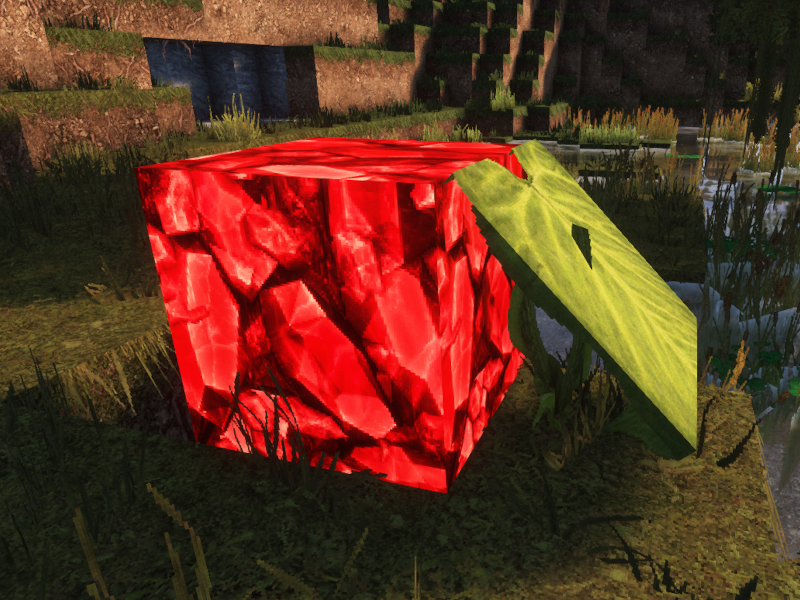
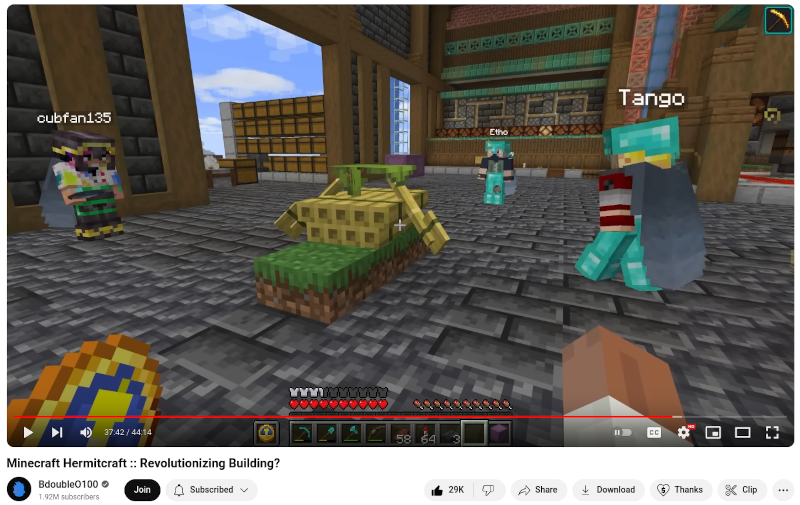

# Leafstone

_**Lock any dripleaf state via redstone**_

## What Does This Mod Do?

This mod implements a feature asked for by legendary redstoner [@BDoubleO100](https://www.youtube.com/@bdoubleo)
to allow dripleaf blocks to be locked in bent positions—not just the unbent state—when getting
a redstone signal—thus revolutionizing Minecraft building forever.

### Planned Features

- Option to allow redstone signals to **trigger** different dripleaf states
- Configuration via modmenu
- Ports to all versions of the game with dripleaf (so 1.17+)
- Neoforge port

## Installation, Usage and Compatibility
For multiplayer, this mod only needs to be installed **server-side**, and, assuming no other mods
are installed on the server, will work for vanilla clients.

## Contributing

Find a bug? Have a suggestion or a question? Want to contribute a new feature or enhancement?
[Open an issue](https://github.com/OpenBagTwo/Leafstone/issues/new)!

## License and Acknowledgements

All code in this repository is licensed under the
[GNU Affero General Public License](https://www.gnu.org/licenses/agpl-3.0.en.html).

You **may** use, modify and redistribute this mod, and  you **may** include this mod within your
modpack or run it on a server, so long as you abide by the terms of
this license, which critically states that you **must** make the source code (including your
modifications to the mod) available to anyone:
- downloading the mod (including modified versions and including within a modpack)
- playing on your server
